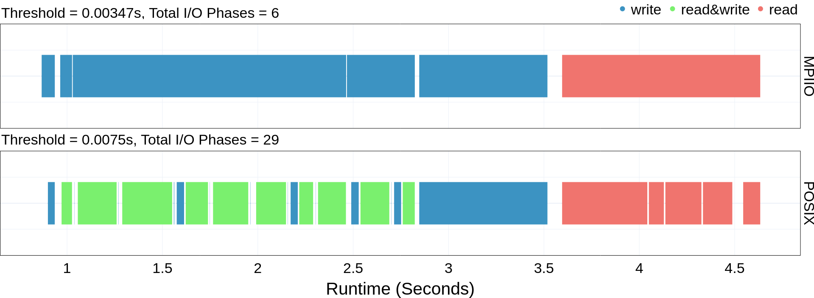

IO Phase Plot
===================================

Once you have the dependencies and DXT Explorer installed, you can run:

.. code-block:: bash

   dxt-explorer -i DARSHAN_FILE_COLLECTED_WITH_DXT_ENABLE.darshan

This will generate the base ``io-phase.html`` plot. The ``io-phase.html`` plot shows the different IO Phases in the data. The plot also shows information regarding the number of I/O phases in each interface (``MPIIO and POSIX``) and the threshold value used to merge the phases.  Contextual information link ``Fastest Rank``, ``Fastest Rank Duration``, ``Slowest Rank``, ``Slowest Rank Duration`` can also be seen by hovering over a phase. 

You are expected to visualize the following messages in the console:

.. code-block:: text

   2022-11-02 12:58:22,979 dxt - INFO - FILE: <Filename> (ID <File ID>)
   2022-11-02 12:58:22,979 dxt - INFO - generating dataframes
   2022-11-02 12:58:26,681 dxt - INFO - generating interactive I/O phase plot for: <Filename>
   2022-11-02 12:58:30,826 dxt - INFO - SUCCESS: <Path to the newly created spatiality.html>
   2022-11-02 12:58:30,834 dxt - INFO - SUCCESS: <Path to the newly created index.html>
   2022-11-02 12:58:30,834 dxt - INFO - You can open the index.html file in your browser to interactively explore all plots

You can find a couple of interactive examples of DXT traces collected from FLASH, E2E, and OpenPMD in the `companion repository <https://jeanbez.gitlab.io/pdsw-2021>`_ for our PDSW'21 paper.

